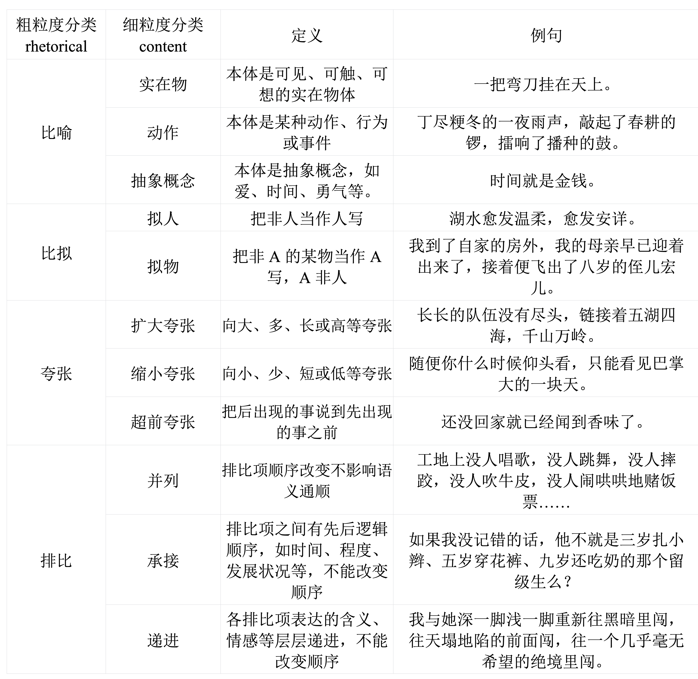

# CCL2024 任务6：中小学作文修辞识别与理解评测

## 更新

[2024/04/16] 测试集和提交链接已通过邮件发送，更新[榜单](docs/leaderboard.md)。请注意，评测最终截止时间为5月15日。

[2024/04/02] 更新[验证集baseline](docs/baseline.md)。

[2024/03/01] 更新[评测模块eval文档](docs/evaluation.md)，`eval`、评测样例和[baseline](docs/baseline.md)。训练集和验证集将通过邮件发送，测试集将在2024年4月初发布。请注意，报名截止日期为2024年3月31日。

[2024/01/30] 更新[报名链接](https://wj.qq.com/s2/14114729/f60c/)，我们将在2024年3月1日前发布数据集和baseline。

## 声明

  本次比赛获得的数据只限于本次比赛，禁止商用，有科研需求请联系组织者。

## 注意事项

  在计算最终成绩时将综合考虑三个track的分数，对于没有参加某个track的队伍，将按照该track的baseline分数进行加权，从而计算总分数。主办方将为获奖队伍提供1万元奖金。

## 组织者与联系方式

  任务组织者：刘诺纬（华东师范大学，计算机科学与技术学院），陈心豪（华东师范大学，计算机科学与技术学院），任育培（华东师范大学，计算机科学与技术学院），兰曼（华东师范大学， 计算机科学与技术学院），柏晓鹏（华东师范大学，中国语言文学系），吴苑斌（华东师范大学， 计算机科学与技术学院）, 毛绍光（微软亚洲研究院），夏炎（微软亚洲研究院）

  任务联系人：刘诺纬（华东师范大学，nwliu@stu.ecnu.edu.cn）

## 任务内容

  在中小学生的学习过程中，修辞手法不仅是阅读理解和写作技巧的核心组成部分，同时也是塑造优秀文学作品的不可或缺的元素。识别并理解学生作文中的修辞使用，可以帮助学生提高作文表达能力，指导学生更高质量的叙述和描写。但是这需要大量的人工成本，对教师在作文评估和教学方面提出了挑战。随着教育的发展和网络的普及，许多研究者和机构开始探索利用计算机技术来实现作文的自动评改[1]，其中修辞手法的使用是教师评改作文的重要组成部分。

   作文修辞的使用反应一篇作文的文采水平和语言表达能力[2]，对于帮助教师评估作文质量，指导学生提升表达能力有重要意义。近年来，针对作文修辞识别的研究通常使用对齐策略等规则，从句子结构，语义信息等语言学特征角度进行排比以及比喻的粗粒度识别[3][4]，或者设计模型结构针对明喻这单一的修辞手法进行识别[5][6]。这些工作一方面对不同的修辞大类（比喻，拟人，夸张，排比）进行独立的识别，缺乏泛用性。另一方面粒度较粗，缺乏多层次，细粒度的修辞类型定义。进一步地，除了针对句子进行修辞类别的识别外，一些工作将修辞理解视作成分抽取任务，例如从比喻句中将本体和喻体抽取出[7]。这些工作缺少对其他修辞的修辞对象以及内容的定义，无法对中小学生作文给出系统全面的指导和意见。

  本次评测数据集来源于以汉语为母语的中小学生考试作文，作文体裁涵盖记叙文和议论文等多种文体。中小学生作文中会出现多种修辞类型，涵盖了对不同事物的多角度描写。因此我们的任务以句系统地定义了中小学作文中出现的细粒度修辞类型，从修辞形式和修辞内容两个角度进行识别，同时还给出修辞使用是否出彩的分数。进一步的，我们定义每种修辞的描述对象和描述内容，有助于教师从句子级理解修辞手法在中小学生作文中的使用情况，并为中小学生练习写作时使用恰当的修辞手法提供帮助。

  基于此，本次评测围绕“中小学作文修辞理解”任务，将修辞手法分为比喻、比拟、夸张和排比，进一步对这4种修辞手法进行细粒度分类，并给出每种修辞描写的对象和内容，包括：

1、中小学作文修辞形式类型识别

2、中小学作文修辞内容类型识别

3、中小学作文修辞成分抽取

共3个赛道，为中小学作文修辞理解提供更多依据。

## 赛道1：中小学作文修辞形式类型识别

### 任务描述

  作文中修辞的识别对于作文文采评估和作文评改具有重要意义。以往的工作通常将修辞识别定义为二分类任务[6], 然而中小学生作文中存在多种修辞的使用，不同的修辞也能进一步划分不同的类型。粗粒度的分类不能识别出修辞的具体类型，不能反应作文的写作水平。本赛道以句子作为基本单位，将每个句子中使用的修辞手法按粗粒度分类成比喻、比拟、夸张、排比和无修辞5类，同时每类修辞进一步从形式角度细粒度分类：

（1）针对比喻修辞，从形式角度按细粒度将修辞成分的显隐分类成明喻、暗喻和借喻3种形式；

（2）针对比拟修辞，从形式角度按细粒度将标志比拟成分的词性分类成名词、动词、形容词和副词等4种形式；

（3）针对夸张修辞，从形式角度按细粒度将夸张的方式分类成直接夸张、间接夸张和融合夸张等3种形式；

（4）针对排比修辞，从形式角度按细粒度将排比项的成分分类成成分排比和句子排比等2种形式。

### 任务定义

  中小学作文修辞类型识别是一个多标签分类问题，预测一条句子使用了哪些类型的修辞，以及从形式上的细粒度分类。本次评测任务共定义4个粗粒度修辞类型和12个修辞形式类型。具体定义及示例如下表：


### 数据样例

```json
{
  "paragraphIdx": 1,
  "sentenceIdx": 1,
  "sentence": "庄稼汉们站在地头，望着这片黄澄澄像狗尾巴的稻谷。",
  "rhetoricalList": [
    {
      "rhetorical": "比喻",
      "form": "明喻"
    }
  ]
}
```

  字段包括具体句子所属篇章ID、包括句子ID、句子文本、粗粒度分类、形式角度细粒度分类。

### 评测数据集

  该赛道的数据来源于中学生作文数据，各项数据分布如表所示。 

| 数据集（Data Set）  |        句子数（sentences）        |
| :-----------------: | :-------------------------------: |
| 训练集（Train Set） |              约700句              |
|  验证集（Dev Set）  |              约300句              |
| 盲测集（Test Set）  | 约5000句（其中约10%用于正式评测） |

### 评价标准

  总分由粗粒度和形式细粒度三部分构成，具体计算方式如下：

$$
F_{1} = 0.3 \times F_{1}^{\text{rhetorical}} + 0.7 \times F_{1}^{\text{form}}
$$

  其中$F_{1}^{\text{rhetorical}}$和$F_{1}^{\text{form}}$分别表示粗粒度分类和形式细粒度的$F_{1}$值。

## 赛道2：中小学作文修辞内容类型识别

### 任务描述

  作文中修辞的识别对于作文文采评估和作文评改具有重要意义。以往的工作通常将修辞识别定义为二分类任务[6], 然而中小学生作文中存在多种修辞的使用，不同的修辞也能进一步划分不同的类型。粗粒度的分类不能识别出修辞的具体类型，不能反应作文的写作水平。本赛道以句子作为基本单位，将每个句子中使用的修辞手法按粗粒度分类成比喻、比拟、夸张、排比和无修辞5类，同时每类修辞进一步从内容角度细粒度分类：

（1）针对比喻修辞，从内容角度按细粒度将本体分类成实在物、动作和抽象概念3种内容；

（2）针对比拟修辞，从内容角度按细粒度将喻体的性质分类成拟人和拟物等2种内容；

（3）针对夸张修辞，从内容角度按细粒度将夸张的方向分类成扩大夸张、缩小夸张和超前夸张等3种内容；

（4）针对排比修辞，从内容角度按细粒度将排比项之间的关系分类成并列、承接和递进等3种内容。

### 任务定义

  中小学作文修辞类型识别是一个多标签分类问题，预测一条句子使用了哪些类型的修辞，以及从内容上的细粒度分类。本次评测任务共定义4个粗粒度修辞类型和11个修辞内容类型。具体定义及示例如下表：



### 数据样例

```json
{
  "paragraphIdx": 1,
  "sentenceIdx": 1,
  "sentence": "庄稼汉们站在地头，望着这片黄澄澄像狗尾巴的稻谷。",
  "rhetoricalList": [
    {
      "rhetorical": "比喻",
      "content": "实在物"
    }
  ]
}
```

  字段包括具体句子所属篇章ID、包括句子ID、句子文本、粗粒度分类、内容角度细粒度分类。

### 评测数据集

  该赛道的数据来源于中学生作文数据，各项数据分布如表所示。 

| 数据集（Data Set）  |        句子数（sentences）        |
| :-----------------: | :-------------------------------: |
| 训练集（Train Set） |              约700句              |
|  验证集（Dev Set）  |              约300句              |
| 盲测集（Test Set）  | 约5000句（其中约10%用于正式评测） |

### 评价标准

  总分由粗粒度和内容细粒度三部分构成，具体计算方式如下：

$$
F_{1} = 0.3 \times F_{1}^{\text{rhetorical}} + 0.7 \times F_{1}^{\text{content}}
$$

  其中$F_{1}^{\text{rhetorical}}$和$F_{1}^{\text{content}}$分别表示粗粒度分类和内容细粒度分类的$F_{1}$值。

## 赛道3：中小学作文修辞成分抽取

### 任务描述

  修辞成分包含句子描写的对象以及具体的描写内容，抽取修辞成分有助于理解学生修辞使用情况，理解修辞描述，能够反映学生语言表达的能力。本赛道以句子作为基本单位，将句子中出现的修辞成分为为连接词、描写对象和描写内容，下面给出从形式角度按细粒度分类后包括的具体修辞成分：

（1）针对比喻修辞，对于明喻形式，修辞成分包括连接词（喻词）、描写对象（本体）和描写内容（喻体）；对于暗喻形式，修辞成分包括描写对象（本体）和描写内容（喻体）；对于借喻形式，修辞成分包括描写内容（喻体）；

（2）针对比拟修辞，不论形式如何，修辞成分都包括描写对象（比拟对象）和描写内容（比拟内容）；

（3）针对夸张修辞，不论形式如何，修辞成分都包括描写对象（夸张对象）和描写内容（夸张内容）；

（4）针对排比修辞，不论形式如何，修辞成分都包括连接词（排比项或排比标记）。

### 任务定义

  任务给定一个句子作为输入，要求抽取出该句子包含的所有修辞成分（连接词、描写对象和描写内容）定义及示例如下表所示：


### 数据样例

```json
{
  "paragraphIdx": 1,
  "sentenceIdx": 1,
  "sentence": "庄稼汉们站在地头，望着这片黄澄澄像狗尾巴的稻谷。",
  "componentList": [
    {
      "conjunction": "像",
      "conjunctionBeginIdx": 16,
      "conjunctionEndIdx": 16,
      "tenor": "稻谷",
      "tenorBeginIdx": 21,
      "tenorEndIdx": 22,
      "vehicle": "狗尾巴",
      "vehicleBeginIdx": 17,
      "vehicleEndIdx": 19
    }
  ]
}
```

  字段包括具体句子所属篇章ID、包括句子ID、句子文本、修辞成分（部分修辞无修辞成分，具体可见赛道3任务定义）、修辞成分对应在句中的起始位置和结束位置（部分修辞无修辞成分，具体可见赛道3任务定义）。

### 评测数据集

  该赛道的数据来源于中学生作文数据，各项数据分布如表所示。 

| 数据集（Data Set）  |        句子数（sentences）        |
| :-----------------: | :-------------------------------: |
| 训练集（Train Set） |              约700句              |
|  验证集（Dev Set）  |              约300句              |
| 盲测集（Test Set）  | 约5000句（其中约10%用于正式评测） |

### 评价标准

  总分由连接词、描写对象和描写内容三部分构成，具体计算方式如下：

$$
F_{1} = \frac{1}{3} \times F_{1}^{\text{conjunction}} + \frac{1}{3} \times F_{1}^{\text{tenor}} + \frac{1}{3} \times F_{1}^{\text{vehicle}}
$$

  其中，$F_{1}^{\text{conjunction}}$、$F_{1}^{\text{tenor}}$和$F_{1}^{\text{vehicle}}$分别表示连接词、描写对象和描写内容的$F_{1}$值。
